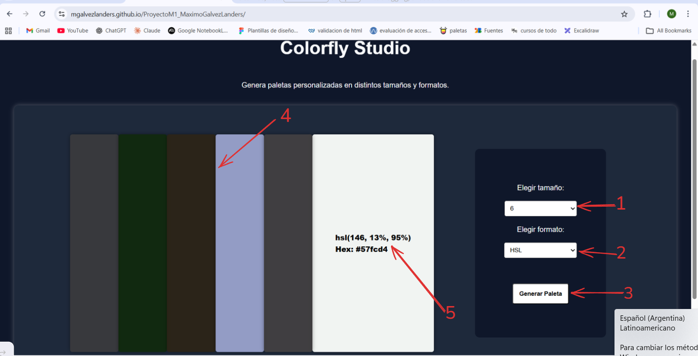

# 🎨 Colorfly Studio

## 📌 Descripción

Página web encargada de generar paletas de colores en distintos formatos y tamaños de manera dinámica y aleatoria.

---

## 👤 Manual de Usuario



1. 🎚 **Selector de tamaño**  
   Permite elegir la cantidad de colores de la paleta: **6**, **8** o **9**.

2. 🎨 **Selector de formato**  
   Permite elegir el formato del color: **HSL** o **HEX**.

3. 🚀 **Botón "Generar Paleta"**  
   Genera una nueva paleta de colores aleatorios.

4. 🟥 **Contenedor de colores**  
   Muestra los colores generados dinámicamente.

5. 🔎 **Código del color**  
   Muestra el código correspondiente al formato seleccionado.

---

## 🛠 Manual Técnico

### 🔧 Tecnologías utilizadas

- 🧱 **HTML** → Estructura y contenido  
- 🎨 **CSS** → Diseño y estilos  
- ⚙️ **JavaScript** → Funcionalidad e interactividad  
- 🗂 **GitHub** → Control de versiones y repositorio  
- 🌍 **GitHub Pages** → Despliegue del proyecto en internet  

---

## 💻 Pasos para descargar y ejecutar la aplicación

1. 📁 Crear una carpeta donde se ejecutará el proyecto.

2. 🖥 Abrir **Visual Studio Code**.

3. 📥 Clonar el repositorio:  

   Ir a la carpeta donde querés guardar el proyecto y ejecutar en la terminal:

   ```bash
   git clone https://github.com/MGalvezLanders/ProyectoM1_MaximoGalvezLanders.git

4. 🔌 Instalar la extensión Live Server.

5. ▶️ Ejecutar el archivo index.html con Live Server.

## 🚀 Pasos para desplegar la aplicación en GitHub Pages

1. 🌐 Ingresar a GitHub.
2. 📂 Entrar al repositorio deseado.
3. ⚙️ Ir a **Settings**.
4. 📄 Entrar en la sección **Pages**.
5. 🌿 Seleccionar la rama (**Branch**) `main`.
6. 📁 Elegir la carpeta:

   - **root** → Si el archivo HTML está en la raíz del repositorio.
   - **docs** → Si existe una carpeta `docs` que contiene el HTML.

7. 💾 Guardar cambios:
   - Presionar el botón **Save**.
   - ⏳ Esperar unos minutos hasta que el sitio se publique.

## Demo en vivo 

[Ver aplicacion en GitHub Pages](https://mgalvezlanders.github.io/ProyectoM1_MaximoGalvezLanders/)

## Google Drive

[Archivo de Google Dirve](https://docs.google.com/document/d/14NhUIDGGBpjyF68mPoktPF0jPyypeCXTJQAh4qjbmQI/edit?usp=drive_link)


   ## AUTOR

   Maximo Galvez Landers, Desarrollador Web 


